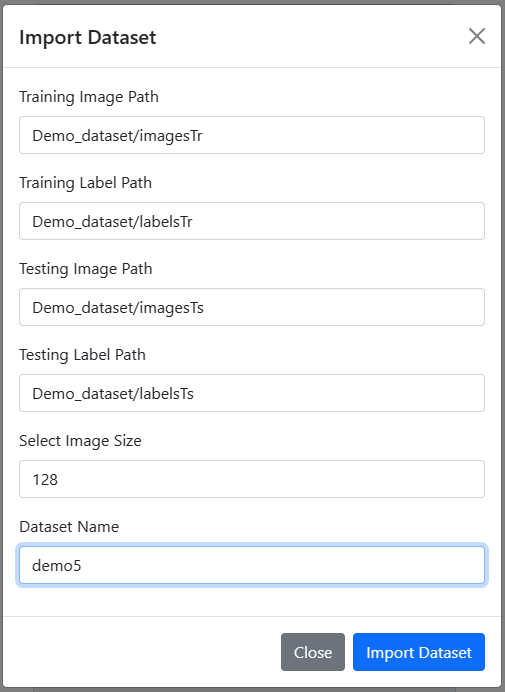
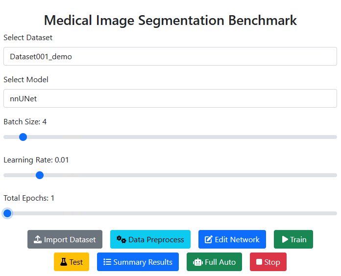

# Setup
Run the following commands in the terminal to create the docker image and run the container:
```
docker build -t medseg /MedSeg
docker run -p 8080:5000 -it medseg
```

Now, install the requirements inside the container by running the following commands:
```
conda activate nnsam
pip3 install torch torchvision torchaudio --index-url https://download.pytorch.org/whl/cu117
pip3 install torch torchvision torchaudio --index-url https://download.pytorch.org/whl/cu121
pip3 install git+https://github.com/ChaoningZhang/MobileSAM.git
pip3 install timm
pip3 install git+https://github.com/Kent0n-Li/nnSAM.git
pip3 install nnunetv2
git clone https://github.com/jpadillaperez/Medical-Image-Segmentation.git
cd Medical-Image-Segmentation && pip3 install -r requirements.txt
```

Finally, run the following command to start the web app:
```
python3 web.py
```

Then open the browser and go to http://localhost:8080/ to see the web app.

# Usage

First load the dataset by clicking Import Dataset button and select the dataset folders.



Then click the Data Preprocessing button to preprocess the dataset.

